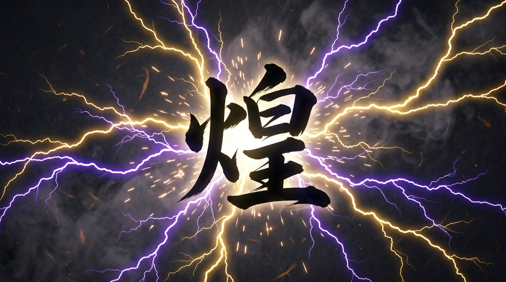

<p align="center"></p>

# Kira

**Hold a key, speak, release. Polished text appears at the cursor.**

Kira is a push-to-talk voice-to-text app that runs entirely on your own machine. Whisper turns speech into text, a local language model fixes punctuation, fillers and register for the app you are typing into. No cloud, no account, no subscription.

[](https://github.com/MikeGT4/kira/releases/latest)


## Two builds, one idea

| | macOS (this branch, `main`) | Windows 11 ([`windows-port`](https://github.com/MikeGT4/kira/tree/windows-port)) |
|---|---|---|
| Hotkey | hold **fn** (Globe key) | hold **F8**, **F9** for AI edit commands |
| Speech to text | mlx-whisper, `whisper-large-v3-turbo` on the Apple GPU | faster-whisper, `large-v3` on CUDA |
| Text cleanup | Ollama, `huihui_ai/qwen3-abliterated:8b` (uncensored) | Ollama, `gemma4:12b`, uncensored model optional |
| Hardware | Apple Silicon (M1 or newer), 16 GB unified memory | NVIDIA GPU with 12 GB VRAM or more |
| Install | app bundle from the [Releases page](https://github.com/MikeGT4/kira/releases) or from source, see below | installer on the [Releases page](https://github.com/MikeGT4/kira/releases/latest) |

## What it does

- **Push to talk.** Hold fn, speak, release. The text lands in whatever field has focus, pasted via the clipboard.
- **Context-aware cleanup.** Kira detects the frontmost app and picks one of five prompts: mail, chat, terminal, code or plain text. A sentence dictated into Mail gets a different register than the same sentence in a terminal.
- **German and English**, detected automatically per dictation.
- **Uncensored by default.** The cleanup model is an abliterated Qwen 3 8B. It is not tuned to refuse or lecture; it only cleans up what you said. Any other Ollama model can be set in the config.
- **Live HUD.** While you hold fn, a dark panel next to the cursor shows the status and a green oscilloscope trace of your voice.
- **Nothing leaves your Mac.** Audio and text stay on the machine. Kira talks to Ollama on `127.0.0.1` only.
- **Warm start.** The cleanup model is loaded when Kira starts and kept in memory for an hour, so the first dictation is as fast as the hundredth.

## Requirements

- macOS on Apple Silicon (tested on an M5 with 16 GB)
- Python 3.12 and [`uv`](https://github.com/astral-sh/uv)
- [Ollama.app](https://ollama.com/download) from ollama.com. The Homebrew formula shipped without the `llama-server` binary on our machine and could not load any model; the official app works.

## Install the app bundle

Download `Kira-<version>-macos-arm64.zip` from the [Releases page](https://github.com/MikeGT4/kira/releases), unzip it and move `Kira.app` to `/Applications`. The bundle is signed ad hoc, not notarised: on the first launch use Control-click, then Open. Then install [Ollama.app](https://ollama.com/download) and pull the cleanup model:

```bash
ollama pull huihui_ai/qwen3-abliterated:8b
```

## Install from source

```bash
git clone https://github.com/MikeGT4/kira.git
cd kira
uv venv --python 3.12
source .venv/bin/activate
uv pip install -e '.[dev]'
ollama pull huihui_ai/qwen3-abliterated:8b
kira
```

The first dictation downloads `mlx-community/whisper-large-v3-turbo` (about 1.5 GB) from Hugging Face.

## Build the app bundle

```bash
./scripts/build_release.sh
cp -R dist/Kira.app /Applications/
```

The script runs py2app, adds the MLX package that py2app cannot collect on its own, strips Finder attributes and signs the bundle ad hoc. Because there is no Apple Developer signature, the first launch needs Control-click, then Open. `scripts/build_app.sh` builds a faster alias bundle for development that keeps pointing at your source tree.

## Permissions

Grant three permissions in System Settings, Privacy & Security:

| Permission | Why |
|---|---|
| Microphone | recording your voice; without it Whisper hallucinates phrases like "Thank you" on silence |
| Accessibility | pasting text with Cmd+V and installing the global key listener |
| Input Monitoring | reading the fn key while another app has focus |

macOS binds these permissions to the bundle's code signature. After every rebuild, remove Kira from the three lists and add it again. Kira logs what is missing to `~/Library/Logs/kira.log`.

## Configuration

`~/.config/kira/config.yaml`, all keys optional:

```yaml
hotkey:
  combo: fn
styler:
  model: huihui_ai/qwen3-abliterated:8b
  timeout_seconds: 12
  keep_alive: 1h
```

`combo` also accepts key combos such as `alt+space` or `ctrl+shift+d`.

## Troubleshooting

| Symptom | What to check |
|---|---|
| Text arrives exactly as spoken, no cleanup | Ollama is not answering. `curl -s http://127.0.0.1:11434/api/version` only proves the server is up. A real request proves it can load a model: `curl http://127.0.0.1:11434/api/chat -d '{"model":"huihui_ai/qwen3-abliterated:8b","messages":[{"role":"user","content":"hi"}],"stream":false}'`. The log shows `Styler warmup complete` when everything is fine. |
| `CGEventTapCreate failed` or `This process is not trusted` in the log | Accessibility or Input Monitoring is missing, or stale after a rebuild. |
| "Launch error" on double-click | The bundle's signature was invalidated by an edit after the build. Run `codesign --force --deep --sign - /Applications/Kira.app` and try again. |

## License

Personal use. See [`LICENSE`](LICENSE) (English and German). Commercial use needs written consent.

Made by [digital roots](https://www.digitalroots.de), Mike Pollow.
